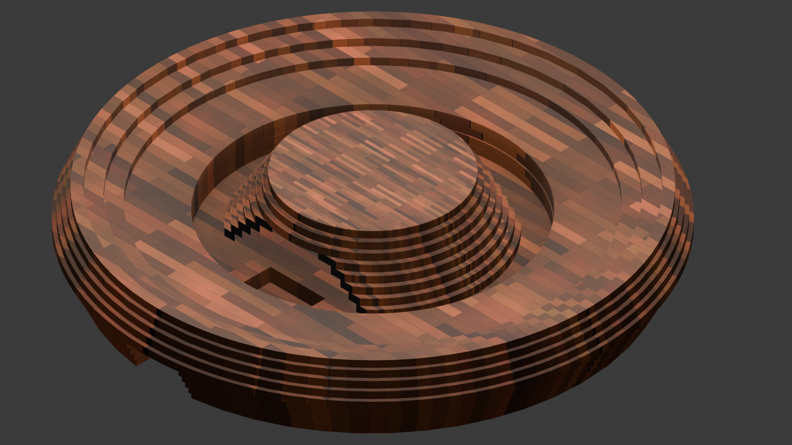

# Pico "Double Rainbow"

This project configures a [RP2040 Stamp Round
Carrier](https://www.solder.party/docs/rp2040-stamp/round-carrier/) and [a
second ring of
Neopixels](https://www.tinytronics.nl/nl/verlichting/ringen-en-modules/ws2812b-digitale-5050-rgb-led-ring-60-leds)
to act as the core of a light fixture.

## Prerequisites

### Hardware

First, you need the right hardware:

1. An RP2040 or RP2035 microcontroller
2. An interior ring of 16 neopixels
3. An exterior ring of 60 neopixels
4. An IR receiver and remote (see below)
5. Something to install it in (see below)

#### Components

The RP2040 Stamp Round Carrier includes a ring of 16 neopixels, so I used that
for my own work. If you don't want to use that, you'll need a [comparable 16
neopixel
ring](https://www.tinytronics.nl/nl/verlichting/ringen-en-modules/ws2812b-digitale-5050-rgb-led-ring-16-leds)
hooked up to the same data pin as the RP2040 Stamp Round Carrier uses (GPIO 24).

The exterior ring I used requires 5 Volts, so it had to be hooked up to the VCC
and ground pins on the Round Stamp Carrier for power. Note, some of the wiring
diagrams in the blueprints directory were from an earlier design where I hoped
to boost the power from the 3.3V connection, which would allow the unit to
function using only a battery. This approach was ultimately unstable and I went
back to using a hard-wired USB connector to provide a full 5 Volts. The data pin
for the external ring should be connectd to GPIO26. 

Most of the functions used in this project are accessed using an IR receiver and
remote. I used [this IR
receiver](https://www.tinytronics.nl/en/communication-and-signals/wireless/infrared/ir-infrared-receiver-module-38khz-940nm)).
Connect the `ground` and `vcc` pins to the `ground` and `3v3` headers on the
explorer base. Connect the `out` pin to the header for `GP5` (you can use
another pin, but you'll need to update the code). Note that this component works
best if it has an unobstructed "line of sight" from outside.  I installed mine
peeking out from under the top of the central ziggurat (see below).

I tested this project with
[the remote from this
kit](https://www.tinytronics.nl/en/communication-and-signals/wireless/infrared/ir-sensor-module-with-remote-and-battery-with-ir-led)
and [the remote for the lights I
have](https://www.amazon.nl/-/en/Changing-Dimmable-Control-Colours-Decoration/dp/B06XYFZ4J5/ref=sr_1_1?sr=8-1).

#### Diffuser and Case

I started with a dome light fixture I found at the thrift store. I used the
original frosted glass diffuser that came with the fixture, but replaced the
base with a laser-cut bamboo base I designed.



Check out [the blueprints](./blueprints/) and [models](./models/) directories
for more information.

### Software

Once you have something to run the code on, you'll need to set up a build
environment. In the past, I have used:

1. The [Getting Started with Pico Guide](https://datasheets.raspberrypi.org/pico/getting-started-with-pico.pdf)
2. The [Pico VS Code extension](https://github.com/raspberrypi/pico-vscode)

Both of those are probably the easiest starting points, and if you hit upon
questions, there are lots of people working with them, so hopefully you can find
the guidance you need.

Personally, I use [distrobox](https://distrobox.it/) and [the docker container
created by `lukstep`](https://github.com/lukstep/raspberry-pi-pico-docker-sdk),
which I set up using commands like:

```
distrobox-create --image lukstep/raspberry-pi-pico-sdk -n pico-sdk
distrobox enter pico-sdk
```

## Building and Installing

### VS Code and a PiProbe

If you have a
[PiProbe](https://www.raspberrypi.com/documentation/microcontrollers/debug-probe.html),
you should be able to use the debugger configuration in this project to build,
install (and debug) the code in this project.

First, you should check the paths in `.vscode/launch.json`and
`.vscode/settings.json` and update them as needed to match your system. Then,
you should be able to just hit the debugger icon and choose the configuration
defined in `.vscode/launch.json`.

The application will be built, deployed, and will pause execution at the
beginning of the `main()` function.

### Manual Build

To build the application from the command line, you can use commands like the
following, starting at the root the repository:

```
mkdir build
cd build
cmake ..
make -j16
```

The last command assumes you have sixteen cores, adjust as needed. Once the
build completes, there are two ways to install the application.

### Installing

If you don't have a PiProbe, reboot your Pico while holding the "Bootsel"
button, then copy or drag the generated UF2 file `pico-double-rainbow.uf2` onto
the USB drive that appears.

If you're lucky enough to have a board with a reset button, all of the binaries
in this project also support entering `bootsel` mode by pressing the reset
button twice. You then copy the `pico-double-rainbow.uf2` file to the USB drive
as described above.

If you have a PiProbe, you can install the program without resetting your Pico
using a command like:

```
sudo openocd -f interface/cmsis-dap.cfg -f target/rp2040.cfg -c "adapter speed 5000" -c "program pico-double-rainbow.elf verify reset exit"
```

## Usage

Once you've put together the hardware and built and installed the binary, the
unit should start up in the default "double rainbow" mode, in which the three
colour channels (red, green, and blue) are represented as bands that move at
different speeds around the rings. The bands are mixed wherever they overlap.
The inner and outer rings move in different directions.

Most of the functions on the Practical Series II remote are supported, i.e. you
can turn the lights off and on, change the brightness level, and choose to
either display a single colour or to use one of the two "rainbow" modes. The
first rainbow mode cycles through six colours (the rainbow, basically, but I
don't distinguish between indigo and violet). The second is the default "double
rainbow" mode described above.
